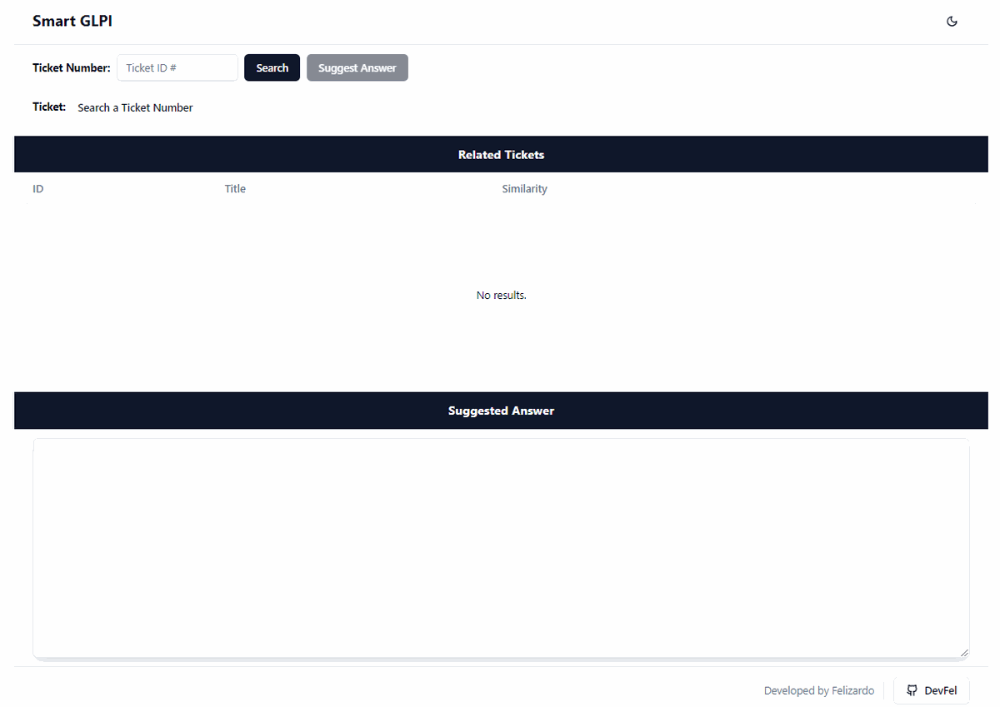

`

  

# 🌐 SMARTGLPI Frontend Web Application

This project is the frontend for the SMARTGLPI system, which interacts with the SMARTGLPI backend to manage and process tickets efficiently.

 
The interactive and simple interface.

  

    </a>
  

## 🌟 Features

- Interface for searching tickets by ID.
- Display related tickets and suggested answers dynamically.
- Interactive UI components built with React and Tailwind CSS.

## ⚙️ Installation and Setup

1. **Clone the Repository**:
   Begin by cloning the repository to your local machine:

   \`\`\`bash
   git clone https://github.com/devfel/smartglpi-web.git
   \`\`\`

2. **Navigate to the Directory**:

   \`\`\`bash
   cd smartglpi-web
   \`\`\`

3. **Install the Required Dependencies**:
   Ensure you have all the required dependencies installed:
   \`\`\`bash
   npm install
   \`\`\`

4. **Start the Development Server**:
   \`\`\`bash
   npm run dev
   \`\`\`

## 🚀 Getting Started

After installation, you can start the development server by running \`npm run dev\`. This will serve the application at \`http://localhost:3000\`.

## 📖 Usage Examples

- **Search Tickets**:
  Use the ticket ID search form to retrieve ticket details and related tickets from the backend.
- **View Suggested Answers**:
  The system dynamically suggests answers based on the ticket details retrieved.

## 🔥 Execution

To build the application for production, use:

\`\`\`bash
npm run build
\`\`\`

This will generate a production-ready build.

## 🔧 Requirements

- Node.js 12.x or newer
- Modern browser with ES6 support

## 📂 Directory Structure

- \`src/\`: Contains all the React components and utility functions.
- \`public/\`: Contains static assets like images and fonts.
- \`index.html\`: The entry point for the application.

## 🙌 Contribution

Feel free to fork the project, open issues, and provide pull requests.

## 📜 License

This project is licensed under the MIT License.
`
